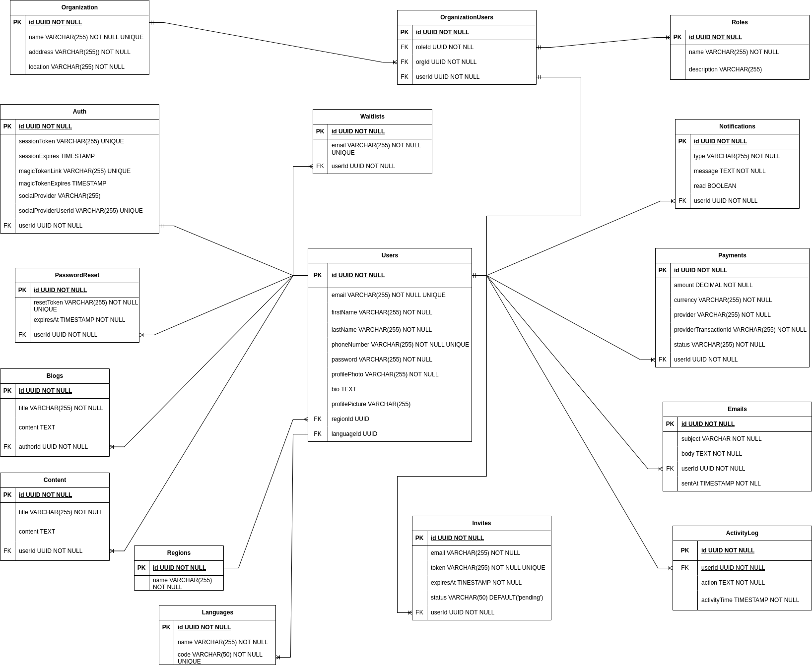

# Team TechWizzy ReadMe

## Project Overview

This repository contains our team's contributions to the HNG Boilerplate Node Web. We have completed the API and database designs as per the Stage 3 Backend Task requirements.

## Project Structure

```
project-root
├── src/  # Source code directory
├── controllers/  # Logic for handling HTTP requests and responses
├── models/  # Data models and database schema definitions
├── routes/  # Endpoint definitions and route handlers
├── services/  # Business logic and application services
└── utils/  # Utility functions and helper modules

├── config/  # Configuration files
├── env/  # Environment-specific configuration variables
└── index.js  # Main configuration loader

├── tests/  # Unit tests and integration tests
├── README.md  # Project README file (you are here!)
└── package.json  # Node.js package configuration file
```

## API Endpoints

### Authentication

- **POST /auth/change-password**
- **POST /auth/login**
- **POST /auth/magic-link**
- **POST /auth/register**
- **GET /auth/social/{provider}**

### Blog Posts

- **GET /blog-posts**
- **GET /blog-posts/{id}**
- **POST /blog-posts/{id}**

### Charts

- **GET /charts**

### Contact

- **POST /contact-us**

### Content Items

- **GET /content-items**
- **POST /content-items**
- **GET /content-items/{userId}**

### Cookies Consent

- **POST /cookies-consent**

### Data Search

- **GET /data-search**

### Email Templates

- **GET /email-templates**
- **POST /email-templates**

### Invite Links

- **GET /invite-links**
- **POST /invite-links**
- **GET /invite-links/{userId}**

### Landing Pages

- **GET /landing-pages/about-us**
- **GET /landing-pages/privacy-policy**

### Languages

- **GET /languages**
- **POST /languages**

### Marketing

- **GET /marketing**

### Messages

- **POST /messages/send-email**

### Notifications

- **GET /notifications/{userId}**

### Payments

- **POST /payments/flutterwave**
- **POST /payments/lemonsqueezy**
- **POST /payments/stripe**

### Profile

- **GET /profile**
- **PUT /profile**

### Regions

- **GET /regions**
- **POST /regions**

### Settings

- **GET /settings**
- **PUT /settings**

### Superadmin

- **GET /superadmin/activity-log**
- **GET /superadmin/orgs**
- **GET /superadmin/payments**
- **GET /superadmin/users**

### User Export

- **GET /user-export**

### Users

- **GET /users**
- **DELETE /users/{id}**
- **GET /users/{id}**
- **PUT /users/{id}**

### Waitlist

- **POST /waitlist**

### Invite

- **POST /invite**

### Link to Api Design YAML File Repo

https://github.com/GreyyDaze/hng-be-stage3-yamlfile

## Database Design

### Overview

Our database design ensures robustness and scalability, supporting the functionalities outlined in the API design.

### Database Schema Tables

1. **Users**
2. **Organizations**
3. **OrganizationUsers**
4. **Roles**
5. **Auth**
6. **Emails**
7. **Payments**
8. **Waitlists**
9. **Notification**
10. **PasswordResets** (Manages password reset tokens)
11. **Blogs**
12. **Invites**
13. **Languages**
14. **Regions**
15. **ActivityLog**
16. **ContentItem**

### Database Schema Tables Image



### Link to Design File

https://drive.google.com/file/d/1KkDHaZnvsMiMqxy5JGFxwFEQhiQMMQAa/view?usp=sharing
